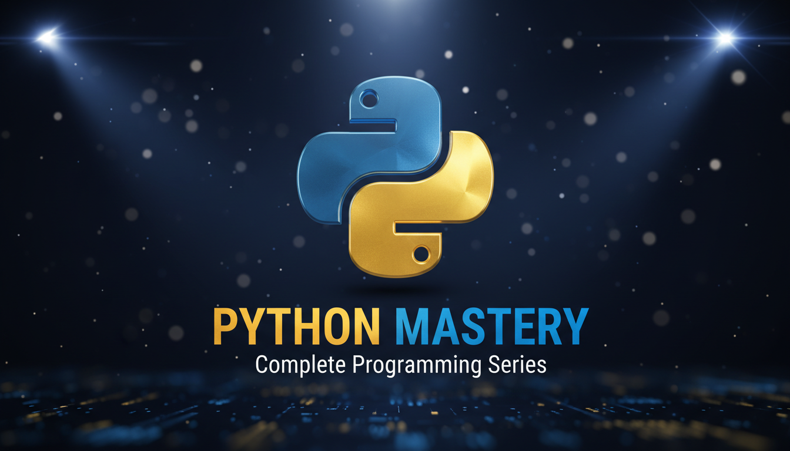

$$([https://www.linkedin.com/in/pejman-ebrahimi-4a60151a7/](https://www.linkedin.com/in/pejman-ebrahimi-4a60151a7/))\ $$ [ (https://img.shields.io/badge/%F0%9F%A4%97_Hugging_Face-FFD21E?style=for-the-badge)](https://img.shields.io/badge/%F0%9F%A4%97_Hugging_Face-FFD21E?style=for-the-badge "url-only")\[ ([https://img.shields.io/badge/🤗\_Hugging_Face-FFD21E?style=for-the-badge](https://img.shields.io/badge/%F0%9F%A4%97_Hugging_Face-FFD21E?style=for-the-badge) "url-only")$$([https://img.shields.io/badge/🤗\_Hugging_Face-FFD21E?style=for-the-badge](https://img.shields.io/badge/%F0%9F%A4%97_Hugging_Face-FFD21E?style=for-the-badge) "url-only" "url-only") \]([https://huggingface.co/arad1367](https://huggingface.co/arad1367))\ $$ [ (https://img.shields.io/badge/Website-008080?style=for-the-badge&logo=About.me&logoColor=white)](https://img.shields.io/badge/Website-008080?style=for-the-badge&logo=About.me&logoColor=white "url-only")\[ ([https://img.shields.io/badge/Website-008080?style=for-the-badge&logo=About.me&logoColor=white](https://img.shields.io/badge/Website-008080?style=for-the-badge&logo=About.me&logoColor=white) "url-only")$$([https://img.shields.io/badge/Website-008080?style=for-the-badge&logo=About.me&logoColor=white](https://img.shields.io/badge/Website-008080?style=for-the-badge&logo=About.me&logoColor=white) "url-only" "url-only") \]([https://arad1367.github.io/pejman-ebrahimi/](https://arad1367.github.io/pejman-ebrahimi/))\ $$ [ (https://img.shields.io/badge/University-00205B?style=for-the-badge&logo=academia&logoColor=white)](https://img.shields.io/badge/University-00205B?style=for-the-badge&logo=academia&logoColor=white "url-only")\[ ([https://img.shields.io/badge/University-00205B?style=for-the-badge&logo=academia&logoColor=white](https://img.shields.io/badge/University-00205B?style=for-the-badge&logo=academia&logoColor=white) "url-only")$$([https://img.shields.io/badge/University-00205B?style=for-the-badge&logo=academia&logoColor=white](https://img.shields.io/badge/University-00205B?style=for-the-badge&logo=academia&logoColor=white) "url-only" "url-only") \]([https://www.uni.li/pejman.ebrahimi?set_language=en](https://www.uni.li/pejman.ebrahimi?set_language=en))    # 🐍 Python Course Repository Welcome to the official repository for my **Python YouTube Series**! 🎓 This repository serves as the central hub for all the materials, code snippets, projects, and resources discussed in my videos. Whether you are a beginner just starting out or looking to refine your skills, you'll find everything we cover in the series right here. ## 📺 About the Series In this series, we dive deep into the world of Python programming. My goal is to make learning Python accessible, practical, and fun. **What you'll find here:** * **Source Code:** Complete code files for every lesson. * **Exercises:** Practice problems to test your knowledge. * **Notes:** Supplementary explanations and cheat sheets. * **Projects:** Real-world examples to build your portfolio. ## 📂 Repository Structure * `/Basics` - Introduction to syntax, variables, and loops. * `/Intermediate` - Functions, modules, and data structures. * `/Advanced` - OOP, decorators, and asynchronous programming. * `/Projects` - Full-scale projects built during the series. ## 📫 Contact Me If you have any questions, suggestions, or just want to say hi, feel free to reach out! * 📧 **Email:** [pejman.ebrahimi77@gmail.com](mailto:pejman.ebrahimi77@gmail.com) --- _Happy Coding!_ 🚀
